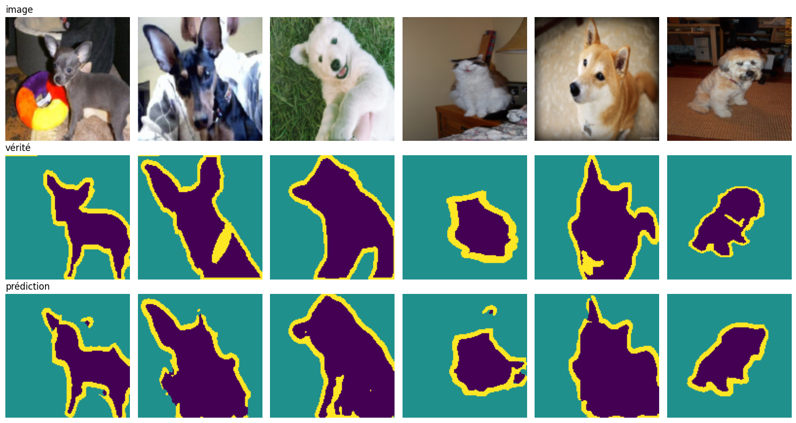
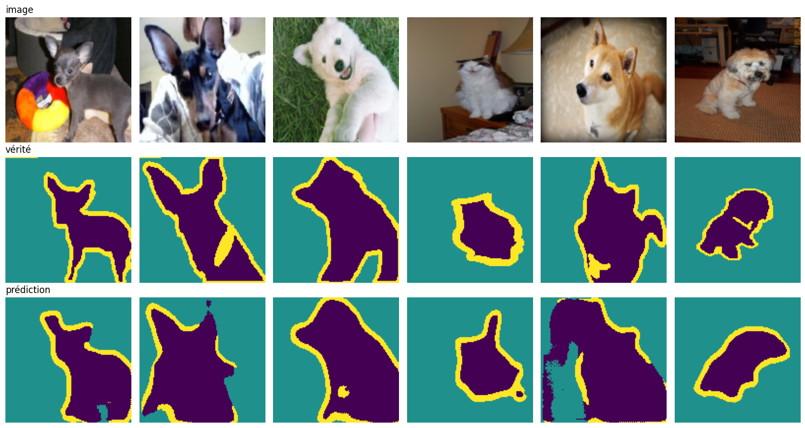

# Image Segmentation — from pixels to U-Net

🇫🇷 [Français](#-français) · 🇬🇧 [English](#-english)

---

## 🇫🇷 Français

Un cours pas à pas pour comprendre la **segmentation d'images** : des méthodes classiques (OpenCV) jusqu'aux réseaux de neurones (U-Net, YOLO).

### Où on va

On entraine un U-Net qui découpe les chiens et les chats pixel par pixel. Voici ce qu'il donne sur des photos qu'il n'a jamais vues :



*De haut en bas : la photo, le vrai masque, la prédiction. Violet = animal, vert = fond, jaune = bordure.*

Les oreilles du chihuahua, les pattes, la tête du shiba : les contours sont bien suivis. Maintenant, le même réseau, entraîné de la même façon, mais **sans les skip connections** :



Le réseau sait à peu près où est l'animal, mais il ne sait plus dessiner ses contours. Le shiba (5e image) est raté, le dernier chien devient une tache.

Les chiffres sur les 3 669 images de test le confirment (IoU, de 0 à 1, plus c'est haut mieux c'est) :

| | Animal | Fond | Bordure | mIoU |
| --- | --- | --- | --- | --- |
| Avec skip connections | **0,798** | **0,888** | **0,471** | **0,719** |
| Sans skip connections | 0,767 | 0,874 | 0,375 | 0,672 |
| Écart | −0,031 | −0,014 | **−0,096** | −0,047 |

C'est la bordure qui perd le plus, et c'est logique : c'est la classe qui demande le plus de précision. L'animal et le fond sont de grandes zones, faciles à deviner même à partir d'une image floue. La bordure, elle, est une bande de quelques pixels autour de l'animal.

Tout le cours sert à comprendre cette différence : ce qu'une convolution voit, pourquoi un réseau perd les détails en descendant, et comment les skip connections les lui rendent.

### L'architecture

Le U-Net du notebook 03 a environ 7,8 millions de paramètres. Il prend une image 128×128 et rend un masque de la même taille, avec 3 classes par pixel (animal, fond, bordure). Les tailles s'écrivent `canaux × hauteur×largeur`.

```text
Descente (encodeur)                       Remontée (décodeur)

  image  3 × 128×128                      masque  3 × 128×128
        │ DoubleConv                          ▲ conv 1×1
        ▼                                     │
  32 × 128×128    ──────── skip ────────► 32 × 128×128
        │ Down                                ▲ Up
        ▼                                     │
  64 × 64×64      ──────── skip ────────► 64 × 64×64
        │ Down                                ▲ Up
        ▼                                     │
  128 × 32×32     ──────── skip ────────► 128 × 32×32
        │ Down                                ▲ Up
        ▼                                     │
  256 × 16×16     ──────── skip ────────► 256 × 16×16
        │ Down                                ▲ Up
        ▼                                     │
        └────────── 512 × 8×8 ────────────────┘
                    (le fond du U)
```

Trois blocs suffisent pour tout construire :

| Bloc | Ce qu'il fait | Taille | Canaux |
| --- | --- | --- | --- |
| **DoubleConv** | 2 × (conv 3×3 → BatchNorm → ReLU) | ne change pas | changent |
| **Down** | max-pooling 2×2, puis DoubleConv | ÷ 2 | × 2 |
| **Up** | conv transposée 2×2, on colle la carte de l'encodeur (skip), puis DoubleConv | × 2 | ÷ 2 |

En descendant, le réseau comprend *ce qu'il y a* dans l'image, mais perd *où* c'est précisément : au fond, il ne reste qu'une grille 8×8. En remontant, chaque bloc Up récupère par la skip connection la carte de l'encodeur du même étage, qui a encore les détails. Sans elle, le décodeur doit tout redessiner à partir de la grille 8×8, d'où les formes molles de la deuxième image.

### Le parcours

Les notebooks sont dans [notebooks/fr/](notebooks/fr/). Suis-les dans l'ordre :

| # | Notebook | Ce que tu apprends |
| --- | --- | --- |
| 01 | [Les bases de la segmentation](notebooks/fr/01_segmentation_basics.ipynb) | Seuillage, contours, K-means, aperçu de YOLO |
| 02 | [Les feature maps](notebooks/fr/02_feature_maps.ipynb) | Comment une convolution « voit » une image |
| 03 | [U-Net](notebooks/fr/03_unet.ipynb) | Construire et entraîner un U-Net, avec et sans *skip connections* |

### Installation

```bash
uv sync
```

Ouvre ensuite un notebook et lance les cellules une par une. Le jeu de données Oxford-IIIT Pet se télécharge tout seul dans `data/`.

---

## 🇬🇧 English

A step-by-step course to understand **image segmentation**: from classic methods (OpenCV) to neural networks (U-Net, YOLO).

### Where we're going

We'll trained U-Net that cuts out dogs and cats pixel by pixel. Here is what it does on photos it has never seen:


*Top to bottom: the photo, the true mask, the prediction. Purple = animal, green = background, yellow = border.*

The chihuahua's ears, the legs, the shiba's head: the outlines are well followed. Now the same network, trained the same way, but **without skip connections**:


The network roughly knows where the animal is, but it can no longer draw its outlines. The shiba (5th image) is missed, and the last dog turns into a blob.

The numbers on the 3,669 test images confirm it (IoU, from 0 to 1, higher is better):

| | Animal | Background | Border | mIoU |
| --- | --- | --- | --- | --- |
| With skip connections | **0.798** | **0.888** | **0.471** | **0.719** |
| Without skip connections | 0.767 | 0.874 | 0.375 | 0.672 |
| Difference | −0.031 | −0.014 | **−0.096** | −0.047 |

The border loses the most, which makes sense: it's the class that needs the most precision. The animal and the background are large areas, easy to guess even from a blurry picture. The border is a band only a few pixels wide around the animal.

The whole course is about understanding this difference: what a convolution sees, why a network loses details on the way down, and how skip connections give them back.

### The architecture

The U-Net from notebook 03 has about 7.8 million parameters. It takes a 128×128 image and returns a mask of the same size, with 3 classes per pixel (animal, background, border). Sizes are written `channels × height×width`.

```text
Going down (encoder)                      Going up (decoder)

  image  3 × 128×128                      mask  3 × 128×128
        │ DoubleConv                          ▲ conv 1×1
        ▼                                     │
  32 × 128×128    ──────── skip ────────► 32 × 128×128
        │ Down                                ▲ Up
        ▼                                     │
  64 × 64×64      ──────── skip ────────► 64 × 64×64
        │ Down                                ▲ Up
        ▼                                     │
  128 × 32×32     ──────── skip ────────► 128 × 32×32
        │ Down                                ▲ Up
        ▼                                     │
  256 × 16×16     ──────── skip ────────► 256 × 16×16
        │ Down                                ▲ Up
        ▼                                     │
        └────────── 512 × 8×8 ────────────────┘
                    (the bottom of the U)
```

Three blocks are enough to build everything:

| Block | What it does | Size | Channels |
| --- | --- | --- | --- |
| **DoubleConv** | 2 × (3×3 conv → BatchNorm → ReLU) | unchanged | change |
| **Down** | 2×2 max-pooling, then DoubleConv | ÷ 2 | × 2 |
| **Up** | 2×2 transposed conv, stick the encoder map next to it (skip), then DoubleConv | × 2 | ÷ 2 |

On the way down, the network understands *what* is in the image but loses *where* exactly: at the bottom, only an 8×8 grid is left. On the way up, each Up block gets the encoder map from the same level through the skip connection, and that map still has the details. Without it, the decoder has to redraw everything from the 8×8 grid, hence the blobby shapes in the second image.

### The learning path

The notebooks are in [notebooks/en/](notebooks/en/). Follow them in order:

| # | Notebook | What you learn |
| --- | --- | --- |
| 01 | [Segmentation basics](notebooks/en/01_segmentation_basics.ipynb) | Thresholding, edges, K-means, a YOLO preview |
| 02 | [Feature maps](notebooks/en/02_feature_maps.ipynb) | How a convolution "sees" an image |
| 03 | [U-Net](notebooks/en/03_unet.ipynb) | Build and train a U-Net, with and without skip connections |

### Setup

```bash
uv sync
```

Then open a notebook and run the cells one by one. The Oxford-IIIT Pet dataset downloads itself into `data/`.

---

## Structure

```text
notebooks/
  fr/        cours en français
  en/        course in English
exercises/   exercices / exercises
img/         images d'exemple / example images
models/      modèles entraînés / trained models (.pt)
data/        dataset (not in git)
outputs/     résultats / results
```
